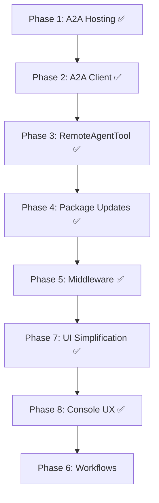

# MS Agent Framework Migration Plan

## Overview

This plan outlines the refactoring of the current implementation to align with MS Agent Framework best practices, based on findings from [REFERENCE-MATERIAL.md](./research-material/REFERENCE-MATERIAL.md).

## Priority Legend

- 🔴 **High** - Critical for proper framework alignment
- 🟡 **Medium** - Improves code quality and patterns
- 🟢 **Low** - Nice-to-have improvements (deferred)

---

## Phase 1: A2A Hosting Migration 🔴 ✅ COMPLETE

Replace Azure Functions manual HTTP handling with ASP.NET Core `MapA2A()` pattern.

### Tasks

- [x] **1.1** Create new ASP.NET Core host project `HemSoft.PowerAI.AgentHost`
  - Add package references: `A2A.AspNetCore`
  - Use `WebApplication.CreateSlimBuilder()` for minimal hosting
  - ✅ Created with proper project structure and configuration

- [x] **1.2** Migrate ResearchAgent hosting
  - Use `app.MapA2A(taskManager, path)` pattern with TaskManager
  - Auto-serve agent card at `.well-known/agent-card.json` via `MapWellKnownAgentCard()`
  - ✅ Implemented with health check endpoint

- [x] **1.3** Remove Azure Functions project `HemSoft.PowerAI.Agents`
  - ✅ Deleted project folder and all contents
  - ✅ Removed from solution file
  - ✅ Removed from VS Code tasks.json
  - ✅ Updated run.ps1 to remove 'agents' mode

- [x] **1.4** Update `A2AAgentHost.cs` to use framework pattern
  - Refactored to use object initializer pattern for TaskManager
  - Removed separate `AttachAgentHandlers` method
  - ✅ Cleaner code aligned with framework patterns

### Before/After

```csharp
// BEFORE: Azure Function with manual handling
[Function("ResearchAgentMessage")]
public Task<HttpResponseData> HandleMessageAsync(...) {
    // Manual JSON parsing, agent invocation, response building
}

// AFTER: ASP.NET Core with MapA2A
var agent = builder.AddAIAgent("research", instructions);
app.MapA2A(agent, "/research", agentCard);
```

---

## Phase 2: Simplify A2A Client 🔴 ✅ COMPLETE

Replace custom `A2AAgentClient` wrapper with built-in `A2ACardResolver`.

### Tasks

- [x] **2.1** Refactor `A2AAgentClient.cs`
  - ~~Current: Custom wrapper with `SendMessageAsync()`~~
  - ✅ Now returns `AIAgent` directly via `A2ACardResolver.GetAIAgentAsync()`
  - Added `Microsoft.Agents.AI.A2A` package for extension method

- [x] **2.2** Update `Program.cs` to use simplified pattern
  - ✅ Removed dependency on custom `A2AAgentClient` instance methods
  - ✅ Using `remoteAgent.AsAIFunction()` directly for agent-as-tool pattern
  - ✅ Updated `RunDistributedChatLoopAsync` to use `AIAgent.RunAsync()`

- [x] **2.3** Simplified `A2AAgentClient.cs`
  - ✅ Converted from instance class to static utility
  - ✅ Returns tuple `(AIAgent, AgentCard)` for direct use

### Before/After

```csharp
// BEFORE: Custom wrapper with instance methods
var client = await A2AAgentClient.ConnectAsync(url);
string response = await client.SendMessageAsync(message);
RemoteAgentTool.SetRemoteAgent(client);
var tool = RemoteAgentTool.CreateTool();

// AFTER: Built-in resolver via extension method
var (agent, card) = await A2AAgentClient.ConnectAsync(url);
var tool = agent.AsAIFunction();  // Direct agent-as-tool!
AgentRunResponse response = await agent.RunAsync(message);
```

---

## Phase 3: Remove RemoteAgentTool 🟡 ✅ COMPLETE

Eliminate static state in `RemoteAgentTool` by using `AsAIFunction()` directly.

### Tasks

- [x] **3.1** Update all consumers of `RemoteAgentTool`
  - ✅ Removed from `CreateCoordinatorWithRemoteOrLocalAgent()`
  - ✅ Removed from `RunDistributedCoordinatorAsync()`
  - ✅ Using `AIAgent.AsAIFunction()` directly

- [x] **3.2** Delete `RemoteAgentTool.cs`
  - ✅ Removed static state pattern
  - ✅ Deleted `src/HemSoft.PowerAI.Console/Agents/Infrastructure/RemoteAgentTool.cs`
  - ✅ Deleted `tests/HemSoft.PowerAI.Console.Tests/RemoteAgentToolTests.cs`

### Before/After

```csharp
// BEFORE: Static state pattern
RemoteAgentTool.SetRemoteAgent(client);
var tool = RemoteAgentTool.CreateTool();
// ... later ...
RemoteAgentTool.ClearRemoteAgent();

// AFTER: Direct usage - no static state!
var (agent, card) = await A2AAgentClient.ConnectAsync(url);
var tool = agent.AsAIFunction();
```

---

## Phase 4: Package Updates 🟡 ✅ COMPLETE

Ensure using latest MS Agent Framework packages.

### Tasks

- [x] **4.1** Audit current package versions
  - ✅ `Microsoft.Agents.AI` - 1.0.0-preview.251125.1 (latest preview)
  - ✅ `Microsoft.Agents.AI.A2A` - 1.0.0-preview.251204.1 (latest preview)
  - ✅ `A2A.AspNetCore` - 0.3.3-preview (latest)

- [x] **4.2** Updated all outdated packages
  - ✅ `SonarAnalyzer.CSharp` 10.16.0 → 10.16.1.129956
  - ✅ `Roslynator.Analyzers` 4.14.0 → 4.15.0
  - ✅ `Roslynator.Formatting.Analyzers` 4.14.0 → 4.15.0
  - ✅ `Meziantou.Analyzer` 2.0.194 → 2.0.260
  - ✅ `Microsoft.CodeAnalysis.NetAnalyzers` 9.0.0 → 10.0.101
  - ✅ `OpenTelemetry.*` 1.12.0 → 1.14.0
  - ✅ `Microsoft.Extensions.AI` 10.0.1 → 10.1.1
  - ✅ `Microsoft.Graph` 5.97.0 → 5.98.0

- [x] **4.3** Build and test verified
  - ✅ Build succeeds with no warnings
  - ✅ All 629 tests pass

---

## Phase 5: Add Middleware for Observability 🟡 ✅ COMPLETE

Add function call middleware for better debugging and telemetry.

### Tasks

- [x] **5.1** Create `FunctionCallMiddleware` helper
  - ✅ Created `src/HemSoft.PowerAI.Console/Telemetry/FunctionCallMiddleware.cs`
  - ✅ Logs tool invocations with function name and arguments (truncated to 500 chars)
  - ✅ Integrated with existing OpenTelemetry via `HemSoft.PowerAI.FunctionCalls` activity source
  - ✅ Handles both streaming and non-streaming responses

- [x] **5.2** Create extension method for easy middleware application
  - ✅ Created `src/HemSoft.PowerAI.Console/Telemetry/ChatClientExtensions.cs`
  - ✅ Provides `UseFunctionCallLogging()` extension on `ChatClientBuilder`

- [x] **5.3** Update agent factories to include middleware by default
  - ✅ Updated `AgentFactory.cs` to add `.UseFunctionCallLogging()` to chat client builder
  - ✅ Registered `HemSoft.PowerAI.FunctionCalls` activity source in `TelemetrySetup.cs`

### Files Created/Modified

- `src/HemSoft.PowerAI.Console/Telemetry/FunctionCallMiddleware.cs` - NEW
- `src/HemSoft.PowerAI.Console/Telemetry/ChatClientExtensions.cs` - NEW
- `src/HemSoft.PowerAI.Console/Agents/Infrastructure/AgentFactory.cs` - Modified
- `src/HemSoft.PowerAI.Console/Telemetry/TelemetrySetup.cs` - Modified

---

## Phase 6: Multi-Agent Workflow Architecture 🟢

Implement intelligent agent selection using MS Agent Framework's built-in handoff pattern.

### Architecture

Use `AgentWorkflowBuilder.StartHandoffWith()` to create a triage agent that routes to specialized agents based on task type.

```
┌─────────────────┐
│  Triage Agent   │  ← Entry point, analyzes task
└────────┬────────┘
         │
    ┌────┴────┐
    ▼         ▼
┌────────┐ ┌────────┐
│Research│ │Weather │  ← Specialized agents
│ Agent  │ │ Agent  │
└────────┘ └────────┘
```

### Tasks

- [ ] **6.1** Add `Microsoft.Agents.AI.Workflows` NuGet package
  - Provides `WorkflowBuilder`, `AgentWorkflowBuilder`
  - Provides handoff, sequential, concurrent patterns

- [ ] **6.2** Create TriageAgent
  - Analyzes incoming requests
  - Routes to appropriate specialist based on task description
  - Can return to coordinator for multi-step tasks

- [ ] **6.3** Implement handoff workflow
  ```csharp
  var workflow = AgentWorkflowBuilder.StartHandoffWith(triageAgent)
      .WithHandoff(triageAgent, [researchAgent, weatherAgent, fileAgent])
      .WithHandoff(researchAgent, triageAgent)  // Return path
      .WithHandoff(weatherAgent, triageAgent)
      .Build();
  ```

- [ ] **6.4** Refactor CoordinatorAgent to use workflow
  - Replace manual agent-as-tool pattern
  - Use `InProcessExecution.StreamAsync()` for execution
  - Handle `WorkflowCompletedEvent` for results

- [ ] **6.5** Add AgentHost support for multiple agents
  - Host agents at distinct paths: `/agents/research`, `/agents/weather`
  - Implement `.well-known/agents` registry for discovery
  - Enable dynamic agent registration

### Benefits

- **Built-in intelligent routing** - Framework handles agent selection
- **Handoff rules** - Declarative routing without custom code
- **Streaming events** - Real-time updates via `AgentRunUpdateEvent`
- **Checkpointing** - Resume long-running workflows
- **Minimal custom code** - Leverage framework, don't rebuild

---

## Phase 7: UI Simplification - Tools to Agents 🔴 ✅ COMPLETE

Simplify the user experience by converting Tools to Agents. The Coordinator routes to specialist agents rather than exposing raw tools. Each agent owns its tools and encapsulates domain logic.

### Architecture Principle

```
┌─────────────────────────────────────────┐
│           CoordinatorAgent              │
│  Routes tasks, doesn't configure tools  │
└──────────────┬──────────────────────────┘
               │
    ┌──────────┼──────────┐
    ▼          ▼          ▼
┌────────┐ ┌────────┐ ┌────────┐
│Research│ │  Mail  │ │ File   │  ← Specialist agents
│ Agent  │ │ Agent  │ │ Tools  │     (local tools stay local)
└────────┘ └────────┘ └────────┘
```

**Design decisions:**
- **Agents own their tools** - Encapsulation, not coordinator-configured
- **Coordinator treats agents as opaque functions** - Uses `agent.AsAIFunction()`
- **Local tools remain tools** - File, Terminal stay as direct tools (no LLM needed)

### Tasks

- [x] **7.1** Create `MailAgent.cs`
  - ✅ Moved `OutlookMailTools` into agent as internal tool
  - ✅ Added instructions for email handling (read, send, delete, spam management)
  - ✅ Uses same model as ResearchAgent (`x-ai/grok-4.1-fast`)
  - ✅ Factory method: `Create(IGraphClientProvider, SpamStorageService?)`

- [x] **7.2** Update `CoordinatorAgent.cs`
  - ✅ Replaced direct `OutlookMailTools` usage with `MailAgent.AsAIFunction()`
  - ✅ Accepts `mailAgent` parameter alongside `researchAgent`
  - ✅ Coordinator no longer needs GraphClientProvider directly for mail

- [x] **7.3** Update `Program.cs`
  - ✅ Creates MailAgent with GraphClientProvider and SpamStorageService
  - ✅ Passes MailAgent to CoordinatorAgent
  - ✅ Simplified tool configuration (agents own their tools)

- [x] **7.4** Update tests
  - ✅ Added `MailAgentTests.cs` for agent creation (6 tests)
  - ✅ Added `FunctionCallMiddlewareTests.cs` for coverage (13 tests)
  - ✅ Existing `OutlookMailToolsTests.cs` remain valid (testing the tool layer)

### Files Created/Modified

- `src/HemSoft.PowerAI.Console/Agents/MailAgent.cs` - NEW
- `src/HemSoft.PowerAI.Console/Agents/CoordinatorAgent.cs` - Modified
- `src/HemSoft.PowerAI.Console/Program.cs` - Modified
- `tests/HemSoft.PowerAI.Console.Tests/MailAgentTests.cs` - NEW
- `tests/HemSoft.PowerAI.Console.Tests/FunctionCallMiddlewareTests.cs` - NEW

### Future candidates (after MailAgent works)

- [ ] **7.5** Evaluate other tools for agent conversion
  - `SpamFilterTools` → Already has `SpamFilterAgent`
  - `WebSearchTools` → Already wrapped by `ResearchAgent`
  - `FileTools` → Keep as tool (no reasoning needed)
  - `TerminalTools` → Keep as tool (no reasoning needed)

### Before/After

```csharp
// BEFORE: Coordinator manually wired with tools
var outlookMailTools = new OutlookMailTools(graphClientProvider, spamStorage);
IList<AITool> tools = [
    AIFunctionFactory.Create(outlookMailTools.MailAsync),  // Exposed as raw tool
    AIFunctionFactory.Create(FileTools.ReadFileAsync),
    // ... many tools listed
];

// AFTER: Coordinator uses specialist agents
var mailAgent = MailAgent.Create(graphClientProvider, spamStorage);
IList<AITool> tools = [
    mailAgent.AsAIFunction(),           // Agent handles mail domain
    researchAgent.AsAIFunction(),       // Agent handles research domain
    AIFunctionFactory.Create(FileTools.ReadFileAsync),  // Local tools stay
];
```

---

## Phase 8: Console UX Simplification 🔴

Radically simplify the console experience to just two modes: natural chat and agent menu.

### Design Philosophy

**Goal**: Remove command clutter. Users should just chat. Agents are invoked via `/` menu.

```
┌─────────────────────────────────────────────────────────┐
│  Power AI                                                │
│  ─────────                                               │
│  Model: x-ai/grok-4.1-fast                               │
│                                                          │
│  Just chat naturally. Type / for agents.                 │
│                                                          │
│  ⟩ How's the weather in Seattle?                         │  ← Cool prompt
│                                                          │
│  ╭─────────────────────────────────────────────────────╮ │
│  │ It's currently 52°F and cloudy in Seattle...        │ │
│  ╰─────────────────────────────────────────────────────╯ │
└─────────────────────────────────────────────────────────┘
```

### Tasks

- [x] **8.1** Simplify to two modes only
  - ✅ Normal chat: Just type, LLM responds with tools as needed
  - ✅ `/` menu: Shows agent picker (Coordinator, SpamFilter, etc.)
  - ✅ Removed: `/clear`, `/usage`, `/spam-scan`, `/spam-review`, etc.

- [x] **8.2** Update input prompt
  - ✅ Changed from `[yellow]You:[/]` to `[cyan]⟩[/]` (chevron prompt)
  - ✅ Cleaner, more modern look

- [x] **8.3** Simplify header display
  - ✅ Removed tools table (users don't need to see this)
  - ✅ Removed verbose agents table
  - ✅ Single line: "Just chat naturally. Type / for agents."

- [x] **8.4** Clean up command parsing
  - ✅ Removed ChatCommand enum values for spam-scan, spam-review, spam-cleanup
  - ✅ Kept only: Empty, Exit, Clear, AgentMenu, Message
  - ✅ `/` triggers agent selection prompt

- [x] **8.5** Agent menu implementation
  - ✅ `/` shows picker: Coordinator, SpamFilter, SpamScan, SpamReview, SpamCleanup, HostResearch
  - ✅ User selects agent → enters that agent's mode
  - ✅ `exit` returns to main chat

### Files Modified

- `src/HemSoft.PowerAI.Console/Program.cs` - Simplified command handling
- `src/HemSoft.PowerAI.Console/Services/CommandInputService.cs` - New prompt, `/` for agents

### Before/After

```csharp
// BEFORE: Cluttered prompt and verbose command parsing
private const string InputPrompt = "[yellow]You:[/] ";
var commands = new Dictionary<string, string> {
    ["/clear"] = "Clear history",
    ["/usage"] = "Token usage",
    ["/spam"] = "Spam filter",
    ["/spam-scan"] = "Scan inbox",
    // ... 10+ more commands
};

// AFTER: Clean prompt and simple agent menu
private const string InputPrompt = "[cyan]⟩[/] ";
private static readonly List<AgentChoice> Agents = [
    new("Coordinator", "Multi-agent orchestration"),
    new("SpamFilter", "Interactive spam management"),
    // ... agents only
];
```

---

## Implementation Order



**Execution sequence:**
1. ~~Phase 1 (A2A Hosting)~~ ✅ Complete
2. ~~Phase 2 (A2A Client)~~ ✅ Complete
3. ~~Phase 3 (RemoteAgentTool)~~ ✅ Complete
4. ~~Phase 4 (Package Updates)~~ ✅ Complete
5. ~~Phase 5 (Middleware)~~ ✅ Complete
6. ~~Phase 7 (UI Simplification)~~ ✅ Complete
7. ~~Phase 8 (Console UX)~~ ✅ Complete
8. Phase 6 (Workflows) - Lowest priority, deferred

---

## Files Affected

| File | Phase | Action | Status |
|------|-------|--------|--------|
| `src/HemSoft.PowerAI.Agents/` | 1 | Delete project | ✅ Deleted |
| `src/HemSoft.PowerAI.AgentHost/` | 1 | New project | ✅ Created |
| `src/HemSoft.PowerAI.Console/Hosting/A2AAgentHost.cs` | 1 | Refactor | ✅ Done |
| `src/HemSoft.PowerAI.Console/Agents/Infrastructure/A2AAgentClient.cs` | 2 | Simplified | ✅ Refactored |
| `src/HemSoft.PowerAI.Console/Agents/Infrastructure/RemoteAgentTool.cs` | 3 | Delete | ✅ Deleted |
| `tests/HemSoft.PowerAI.Console.Tests/RemoteAgentToolTests.cs` | 3 | Delete | ✅ Deleted |
| `src/HemSoft.PowerAI.Console/Program.cs` | 2, 3 | Refactor | ✅ Done |
| `Directory.Build.props`, `*.csproj` | 4 | Package updates | ✅ Updated |
| `src/HemSoft.PowerAI.Console/Telemetry/FunctionCallMiddleware.cs` | 5 | New middleware | ✅ Created |
| `src/HemSoft.PowerAI.Console/Telemetry/ChatClientExtensions.cs` | 5 | Extension method | ✅ Created |
| `src/HemSoft.PowerAI.Console/Agents/Infrastructure/AgentFactory.cs` | 5 | Add middleware | ✅ Modified |
| `src/HemSoft.PowerAI.Console/Telemetry/TelemetrySetup.cs` | 5 | Add activity source | ✅ Modified |
| `src/HemSoft.PowerAI.Console/Agents/MailAgent.cs` | 7 | New agent | ✅ Created |
| `src/HemSoft.PowerAI.Console/Agents/CoordinatorAgent.cs` | 7 | Use MailAgent | ✅ Modified |
| `src/HemSoft.PowerAI.Console/Program.cs` | 7 | Simplify tool listing | ✅ Modified |
| `tests/HemSoft.PowerAI.Console.Tests/MailAgentTests.cs` | 7 | New tests | ✅ Created |
| `tests/HemSoft.PowerAI.Console.Tests/FunctionCallMiddlewareTests.cs` | 5 | Coverage tests | ✅ Created |
| `src/HemSoft.PowerAI.Console/Program.cs` | 8 | Simplified UX | ✅ Modified |
| `src/HemSoft.PowerAI.Console/Services/CommandInputService.cs` | 8 | New prompt, agent menu | ✅ Modified |
| `src/HemSoft.PowerAI.Shared/Agents/TriageAgent.cs` | 6 | New agent | 🟢 Deferred |

---

## Success Criteria

- [x] All A2A endpoints use `MapA2A()` pattern (via AgentHost)
- [x] Agent cards automatically served at `.well-known/agent-card.json`
- [x] Simplified A2A client (returns AIAgent directly)
- [x] No static state for remote agents (RemoteAgentTool deleted)
- [x] Azure Functions project removed
- [x] All tests pass (648 tests passing)
- [x] Build succeeds with no warnings
- [x] Package versions updated to latest
- [x] Function call middleware integrated with OpenTelemetry
- [x] MailAgent created with encapsulated OutlookMailTools
- [x] Coordinator uses MailAgent.AsAIFunction() instead of raw tool
- [x] UI simplified (fewer exposed options)
- [x] Console UX radically simplified - just chat + `/` for agents
- [x] Modern prompt character (`⟩`) replaces "You:"
- [ ] Multi-agent handoff workflow implemented (deferred)

---

## References

- [REFERENCE-MATERIAL.md](./research-material/REFERENCE-MATERIAL.md) - Full framework documentation
- [rwjdk/MicrosoftAgentFrameworkSamples](https://github.com/rwjdk/MicrosoftAgentFrameworkSamples) - Reference implementations
